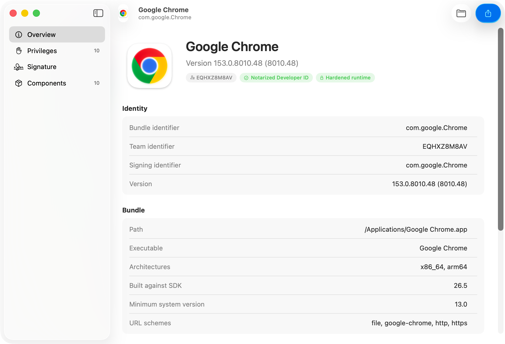

# AppRay

A macOS tool for Mac admins. Drop an application on it and it reads what that
app can reach — usage descriptions, entitlements, linked frameworks, nested
helpers — then builds the MDM configuration that matches: a **PPPC profile**
(`.mobileconfig`) and a **DDM declaration** (`com.apple.configuration.app.settings`).



## Why

Writing a PPPC profile by hand means running `codesign -dvvv`, running
`codesign -d -r-` for the designated requirement, grepping `Info.plist` for
`NS*UsageDescription` keys, and then assembling XML — or, for declarative
management, assembling the *composed identifier*:

```
com.example.app {identifier "com.example.app" and anchor apple generic}
```

That last one is a reliable source of mistakes. This app builds it for you and
shows you what it is doing.

## What it shows

| Section | Contents |
| --- | --- |
| **Overview** | Icon, name, version, bundle ID, team ID, Gatekeeper verdict, architectures, SDK, URL schemes — and the two strings MDM targets the app by |
| **Privileges** | Every privacy-relevant capability found, grouped by how strong the evidence is, with the literal `Info.plist` key or entitlement that triggered it |
| **Signature** | Designated requirement, CDHash, certificate chain, hardened runtime, notarization ticket, full entitlements tree, linked frameworks |
| **Components** | Privileged helpers, login items, XPC services, system extensions and plug-ins, each with its own team ID and requirement |

Every value copies to the clipboard on click.

### Three levels of confidence

The analyzer never guesses silently:

- **Declared by the app** — a usage description or an entitlement says so outright.
- **Inferred from the binary** — the executable links a framework that needs it
  (ScreenCaptureKit, CoreLocation, EndpointSecurity …) but nothing declares it.
  Not pre-selected for export.
- **Requires your judgement** — Accessibility, Full Disk Access, Input Monitoring
  and Send Keystrokes leave no trace whatsoever in a bundle. They are offered,
  never assumed.

## What it exports

Both outputs are generated from the same set of decisions, and the app is
explicit about what each channel cannot carry.

**PPPC profile** — a `com.apple.TCC.configuration-profile-policy` payload,
device-scoped, using the modern `Authorization` key.

**DDM declaration** — `com.apple.configuration.app.settings` with
`Privacy.PermissionDefaults`, macOS 27 and later, supervised enrollment.

### The honest limits

These are enforced by the app, not buried in a footnote:

- **Camera, Microphone and Screen Recording cannot be granted by any profile.**
  Apple's own schema says a profile "can't grant access … it can only deny it".
  Select Allow for one of these and it is dropped from the profile, with the
  reason shown.
- **DDM privacy keys can only pre-approve, never deny.** A Deny decision has no
  DDM representation and is reported as an omission.
- **Full Disk Access, Screen Recording, Apple Events and the folder services
  have no DDM privacy key.** They stay PPPC-only.
- **Camera, Microphone, Accessibility, Speech Recognition and Bluetooth are
  deprecated as PPPC keys in macOS 27**; the app flags each one and points at
  its DDM successor.
- **Apple Events needs a receiving app.** All three `AEReceiver*` keys are
  required, so the service is left out until you supply a receiver.

Anything left out of an export is listed above the preview. Nothing is dropped
quietly.

## Building

Requires Xcode 26 or later and macOS 26 or later.

```bash
brew install xcodegen
./scripts/generate_project.sh
./scripts/build.sh
```

`project.yml` is the source of truth; the `.xcodeproj` is generated and not
checked in. The app builds ad-hoc signed so it works on any machine — set your
own team in Xcode under Signing & Capabilities to notarize and distribute it.

Run the tests with:

```bash
xcodebuild -project AppRay.xcodeproj -scheme AppRay test
```

Some tests cross-check the analyzer against `codesign` on real system apps, and
validate a generated profile with `plutil -lint`.

You can also point it at an app from the command line:

```bash
open -a AppRay /Applications/Google\ Chrome.app
```

## Design notes

**Not sandboxed, hardened runtime on.** The app reads bundles anywhere on disk
and runs `spctl` and `stapler` to determine Gatekeeper state. Everything else —
signing identity, entitlements, designated requirement, CDHash — comes straight
from Security.framework, with no subprocess and no output parsing.

**Gatekeeper runs separately.** `spctl` takes about six seconds on a bundle the
size of Chrome, so the rest of the analysis (under 100 ms for the same app)
lands first and the badge fills itself in.

**`Reference/`** holds the two Apple schema files the exporters are written
against, vendored so the tests do not depend on the network:

- [`com.apple.TCC.configuration-profile-policy.yaml`](Reference/com.apple.TCC.configuration-profile-policy.yaml)
- [`com.apple.configuration.app.settings.yaml`](Reference/com.apple.configuration.app.settings.yaml)

Both come from [apple/device-management](https://github.com/apple/device-management),
which is MIT licensed; Apple's notice is kept alongside them in
[`Reference/LICENSE-apple-device-management.txt`](Reference/LICENSE-apple-device-management.txt).

## Prior art

[Show Me Your ID 3.0](https://hcsonline.com/support/resources/apps/show-me-your-id)
does the drag-and-drop-for-a-code-requirement part. This app aims to cover the
rest of the trip to a working MDM payload.

## Licence

MIT — see [LICENSE](LICENSE).
